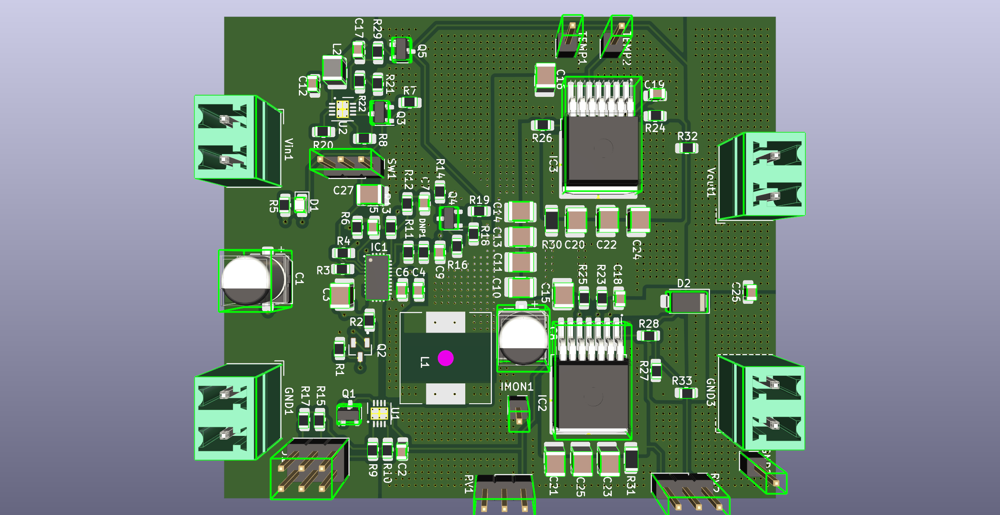

# **Craft Power Labs - Open Source Lab Equipment Initiative**  
### **Bench Top Power Supply - CPRPS24V3A**  
An open-source variable lab bench power supply designed for education, hobbyists, and non-profit initiatives. Part of the **Craft Power Labs Initiative**, funded initially by **DERBI / Nidhi Prayas**.  

---

## **📜 Project Overview**  
Craft Power Labs aims to provide accessible, high-quality, and open-source lab equipment for electronics learning and research. This power supply is built to match the essential features of commercial-grade bench power supplies while remaining completely open-source for personal, educational, and non-commercial use.  

---

## **📊 Technical Specifications (Datasheet)**  

| **Feature**             | **Specification**             |
|-------------------------|-----------------------------|
| **Input Supply**        | 110V ~ 220V AC              |
| **Variable Voltage**    | 0V to 24V                   |
| **Current Capacity**    | Up to 3A                    |
| **Voltage Resolution**  | 10mV                        |
| **Current Limit Resolution** | 50mA                 |
| **Voltmeter Resolution** | 100mV                      |
| **Ammeter Resolution**  | 100mA                        |
| **Noise & Ripple (@ 20MHz)** | < 50mV               |
| **Operating Modes**     | Constant Voltage (CV), Constant Current (CC) |
| **Safety Features**     | Over Current, Short Circuit, Reverse Voltage Bypass |
| **Display**            | 1-inch Volt-Amp Meter Digits |
| **Control**            | Multi-Turn Potentiometers    |
| **Connectors**         | 4mm Banana Sockets          |
| **AC Port**            | IEC 14 Port with Illuminated SPST Switch + Fuse |

---

## **📷 Images & Renders**  
  

---

## **📜 Licensing**  
This project is licensed under **CC BY-NC-SA 4.0**, which means:  
✔ Free to use, modify, and distribute for personal, educational, and non-commercial purposes.  
✔ Must provide attribution and share derivative works under the same license.  
❌ **Not for commercial use** without explicit permission.  

For more details, see: [LICENSE.md](./LICENSE.md)  

📩 **For inquiries, contact us:**  
**Email:** [connect@craftpower.cc](mailto:connect@craftpower.cc)  
**Website:** [https://craftpower.cc](https://craftpower.cc)  

---

## **🛠 Getting Started**  
### **1️⃣ Hardware Design**  
- Schematic and PCB files are available in the `/hardware` directory.  
- Designed using **KiCad**.  

### **2️⃣ Assembly & Testing**  
- Refer to the `assembly_guide.md` for step-by-step assembly instructions.  
- Use the `calibration_guide.md` to fine-tune voltage and current accuracy.  

---

## **🛠 Contributing**  
We welcome contributions! If you'd like to improve the design, add new features, or fix bugs:  
1. Fork this repository  
2. Create a new branch (`feature-new-component`)  
3. Submit a Pull Request  

---

## **🌍 Join the Community**  
Be part of our mission to make electronics lab equipment open-source and accessible.  

💬 **Join our discussion forum**: [Forum Link]  
📢 **Follow updates**: [Social Media Link]  

---

🚀 **Craft Power Labs - Powering Learning, One Bench at a Time!**
